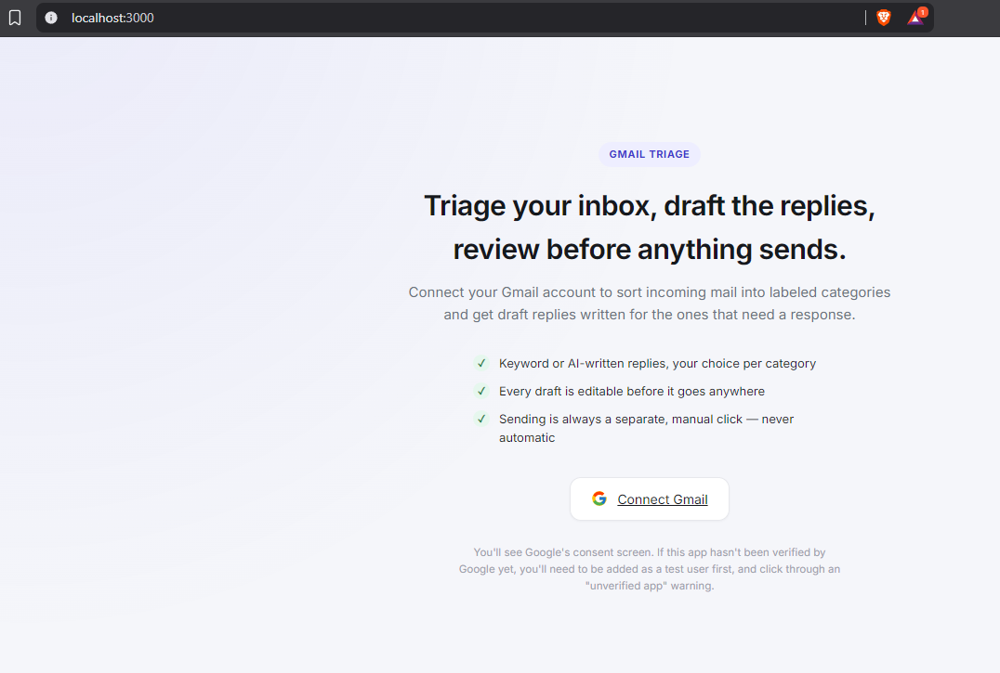
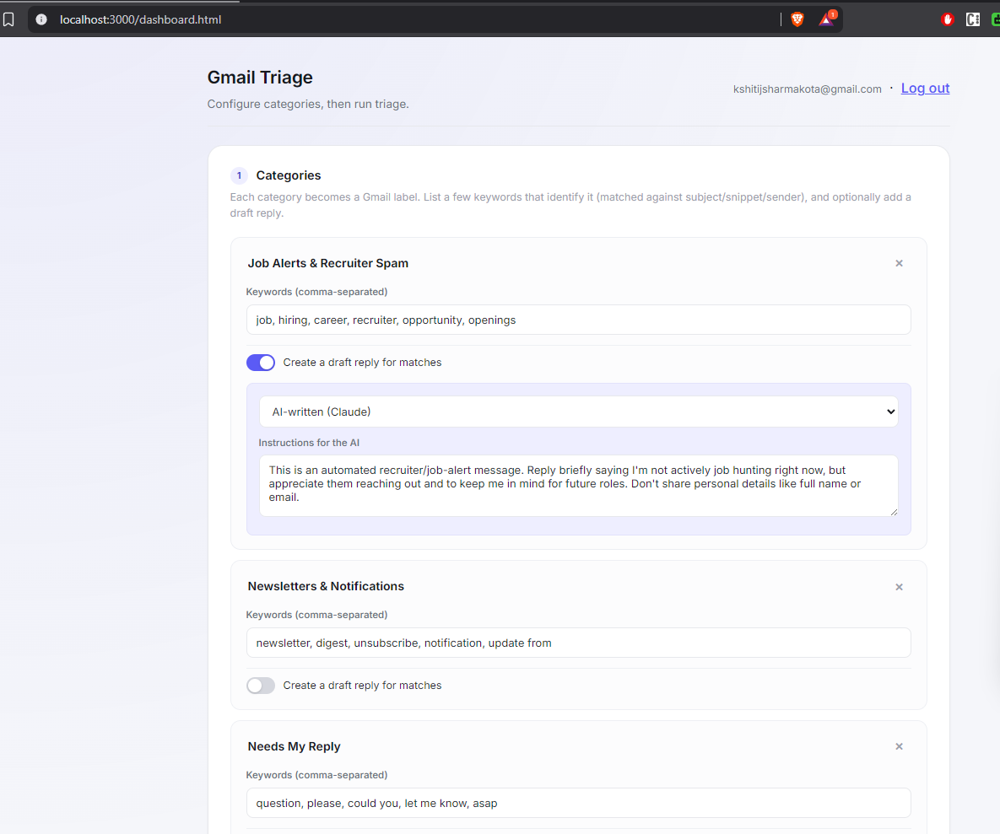
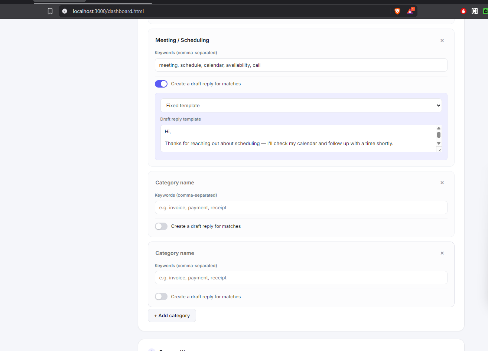
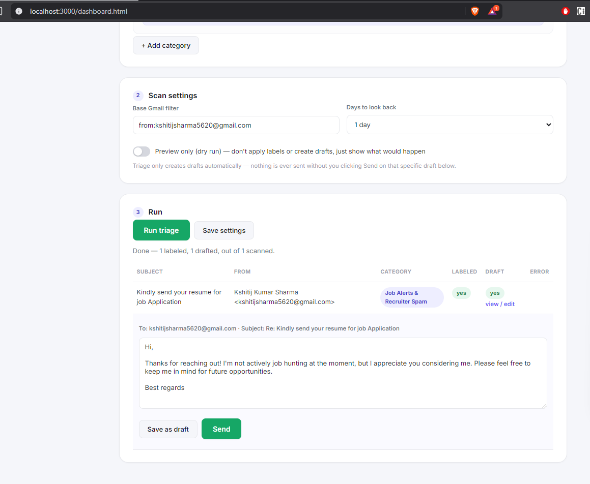

# Gmail Triage + Auto-Reply Drafts (multi-user)

A small self-hosted web app: users log in with their own Google account, define
triage categories with keyword rules and optional draft-reply templates, and
run scans against their inbox. Matches get a Gmail label; categories with a
reply enabled get a **draft** created automatically. Triage itself never
sends anything — sending is a separate, manual action you take per-draft from
the dashboard (view it, edit it if you want, then click Send).

## Does this cost money?

Generally no, for a small number of users:

- **Google Cloud OAuth app**: free to create.
- **Gmail API usage**: free — well within Google's free quota for this volume.
- **Storage**: a local JSON file (`data/db.json`), no paid database required.
- **Classification**: keyword matching, no LLM API calls, no per-run cost.
- **Hosting**: free tiers exist (Render, Fly.io, Railway) — the tradeoff is
  cold starts / limited always-on time, not money.

Where cost *can* show up:
- A custom domain, if you want one (~$10–15/yr) — optional, a free subdomain
  from your host works fine.
- If you outgrow a free hosting tier's request/compute limits.
- If you turn on **AI-written replies** (see below) — that calls the
  Anthropic API with your own key and incurs standard per-token usage cost.
  Small at personal-inbox volume, but real, unlike the free keyword
  classifier.

**Verification caveat (not money, but time):** Gmail label/draft scopes are
"sensitive" scopes. While your OAuth app is in "Testing" mode, only up to 100
email addresses you've explicitly added as test users can log in, and they'll
see an "unverified app" warning to click through. To open it to the public
without that warning, you submit the app for Google's verification review,
which is free but can take from a few days to a few weeks.

## 1. Create the Google OAuth app

Google's console UI is organized under **APIs & Services > Google Auth
Platform** now, split across a few tabs (Overview, Branding, Audience,
Clients, Data Access, Verification Center, Settings) instead of one page:

1. Go to [Google Cloud Console](https://console.cloud.google.com/) and create
   a new project (or reuse one).
2. **APIs & Services > Library** — enable the **Gmail API**.
3. **Google Auth Platform > Branding** — set an app name and a support
   email. Required before Audience will let you save.
4. **Google Auth Platform > Audience** — choose **External** as the user
   type. Scroll down to **Test users** and add the Gmail address of
   everyone who should be able to log in while the app is unverified (up to
   100).
5. **Google Auth Platform > Data Access** — add these scopes:
   - `https://www.googleapis.com/auth/gmail.modify` (read messages/labels,
     create labels, AND attach labels to messages — `gmail.labels` alone
     only manages label *definitions*, it can't attach one to a message)
   - `https://www.googleapis.com/auth/gmail.compose` (create/update drafts —
     this scope also covers sending a draft, which is what powers the
     Send button on the dashboard; triage itself never calls send, only
     create/update draft)
6. **Google Auth Platform > Clients > Create Client**, type "Web
   application". Add an authorized redirect URI matching where you'll run
   this app, e.g. `http://localhost:3000/auth/google/callback` for local
   testing, or `https://yourapp.onrender.com/auth/google/callback` once
   deployed.
7. Copy the generated **Client ID** and **Client Secret** from the client
   you just created.

## 2. Configure and run locally

```bash
cd gmail-triage-webapp
cp .env.example .env
# edit .env: paste your GOOGLE_CLIENT_ID / GOOGLE_CLIENT_SECRET,
# and set SESSION_SECRET to any random string

npm install
npm start
```

Open `http://localhost:3000`, click **Connect Gmail**, sign in with a test
user account, and you'll land on the dashboard.

## 3. Using it

- **Categories**: name + comma-separated keywords (matched against subject,
  snippet, and sender). Enable "Create a draft reply" to add a reply.
- **Reply mode**, once a category has replies on:
  - **Fixed template** (default, free): the same text every time.
  - **AI-written (Claude)**: reads the actual email and writes a fresh,
    contextual reply. The template box becomes instructions for the AI
    (tone, what to say) instead of literal reply text. Requires
    `ANTHROPIC_API_KEY` in `.env` — get one at
    [console.anthropic.com](https://console.anthropic.com/settings/keys).
    Without a key set, this option is disabled in the dashboard and any
    category still configured for it will show an error in the results
    table instead of silently falling back.
- **Scan settings**: a base Gmail search filter (default
  `in:inbox is:unread`) plus a "days to look back" dropdown, capped at 10
  days, which appends `newer_than:Nd` to the query.
- **Dry run** is on by default — it previews matches without touching
  Gmail. Turn it off and re-run to actually apply labels / create drafts.
- **After a real run**, any drafted row gets a "view / edit" link that
  expands an editable box right there with the draft's To/Subject and body.
  From there: **Save as draft** updates the Gmail draft with your edits, or
  **Send** saves your edits and sends it immediately (with a confirm prompt
  first, since it can't be undone). Triage creating the draft is automatic;
  sending it is always a separate, explicit click.

## Screenshots

**Landing page** — connect your Gmail account:


**Dashboard categories** — configure keywords and auto-reply templates:


**Category configuration** — set up matching rules with optional draft replies:


**Run triage** — scan inbox, review matches, and send drafts:


## 4. Deploying so other people can use it

Any Node-friendly host works. Free-tier options:

- **Render** (render.com): create a "Web Service" from this repo, set the
  same env vars as `.env`, and update `GOOGLE_REDIRECT_URI` /
  `GOOGLE_REDIRECT_URI` in both Google Cloud Console and your `.env` to your
  Render URL.
- **Fly.io** / **Railway**: similar — set env vars, deploy, update the
  redirect URI in Google Cloud Console to match your live URL.

Remember: `data/db.json` is stored on local disk. On most free hosts the
filesystem is ephemeral (wiped on redeploy/restart) — fine for testing, but
for anything longer-lived, swap `db.js` for a real database (e.g. a free
Postgres tier on Supabase/Neon) before relying on it.

## Notes on scope

The app requests `gmail.modify` (read/search/classify, create labels, and
attach them to messages) and `gmail.compose` (create/update/send drafts). It
cannot delete anything or read/write anything outside Gmail. Sending is
technically possible with this scope, but the code only ever calls it from
the explicit per-draft Send button — triage itself only creates drafts.

Both scopes are classified by Google as **Restricted** — see the cost
breakdown above for what that means if you outgrow Testing mode's 100-user
cap (a paid CASA security assessment, not just free verification).

If you already went through OAuth setup with the old `gmail.readonly` +
`gmail.labels` scopes, update the Data Access tab to the two scopes above,
restart the app, then log out and reconnect (`/logout` then `/auth/google`)
so Google issues a token with the new scope — labeling won't work until you
do this.
